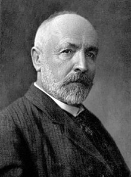

<table class="infobox biography vcard">
<tbody>
<tr>
<th colspan="2">

Georg Cantor

</th>
</tr>
<tr>
<td colspan="2"></td>
</tr>
<tr>
<th scope="row">Born</th>
<td>

Georg Ferdinand Ludwig Philipp Cantor

 March 3, 1845 

<a title="Saint Petersburg" href="https://en.wikipedia.org/wiki/Saint_Petersburg">Saint Petersburg</a>,&nbsp;<a title="Russian Empire" href="https://en.wikipedia.org/wiki/Russian_Empire">Russian Empire</a>

</td>
</tr>
<tr>
<th scope="row">Died</th>
<td>January 6, 1918&nbsp;(aged&nbsp;72) 

<a title="Halle (Saale)" href="https://en.wikipedia.org/wiki/Halle_(Saale)">Halle</a>,&nbsp;<a title="Province of Saxony" href="https://en.wikipedia.org/wiki/Province_of_Saxony">Province of Saxony</a>,&nbsp;<a title="German Empire" href="https://en.wikipedia.org/wiki/German_Empire">German Empire</a>

</td>
</tr>
<tr>
<th scope="row">Nationality</th>
<td class="category">German</td>
</tr>
<tr>
<th scope="row">Alma&nbsp;mater</th>
<td>

<ul>
<li><a title="ETH Zurich" href="https://en.wikipedia.org/wiki/ETH_Zurich">Swiss Federal Polytechnic</a></li>
<li><a title="Humboldt University of Berlin" href="https://en.wikipedia.org/wiki/Humboldt_University_of_Berlin">University of Berlin</a></li>
</ul>

</td>
</tr>
<tr>
<th scope="row">Known&nbsp;for</th>
<td><a title="Set theory" href="https://en.wikipedia.org/wiki/Set_theory">Set theory</a></td>
</tr>
<tr>
<th scope="row">Spouse(s)</th>
<td>

Vally Guttmann (<abbr title="married">m.</abbr>&nbsp;1874)

</td>
</tr>
<tr>
<th scope="row">Awards</th>
<td><a title="Sylvester Medal" href="https://en.wikipedia.org/wiki/Sylvester_Medal">Sylvester Medal</a>&nbsp;(1904)</td>
</tr>
<tr>
<td colspan="2"><strong>Scientific career</strong></td>
</tr>
<tr>
<th scope="row">Fields</th>
<td class="category"><a title="Mathematics" href="https://en.wikipedia.org/wiki/Mathematics">Mathematics</a></td>
</tr>
<tr>
<th scope="row">Institutions</th>
<td><a class="mw-redirect" title="University of Halle" href="https://en.wikipedia.org/wiki/University_of_Halle">University of Halle</a></td>
</tr>
<tr>
<th scope="row"><a title="Thesis" href="https://en.wikipedia.org/wiki/Thesis">Thesis</a></th>
<td>De aequationibus secundi gradus indeterminatis&nbsp;(1867)</td>
</tr>
<tr>
<th scope="row"><a title="" href="https://en.wikipedia.org/wiki/Doctoral_advisor">Doctoral advisor</a></th>
<td>

<ul>
<li><a title="Ernst Kummer" href="https://en.wikipedia.org/wiki/Ernst_Kummer">Ernst Kummer</a></li>
<li><a title="Karl Weierstrass" href="https://en.wikipedia.org/wiki/Karl_Weierstrass">Karl Weierstrass</a></li>
</ul>

</td>
</tr>
</tbody>
</table>
 

<h2> Books </h2>
<ul>
  
 <li><a target="_blank" href="https://github.com/manjunath5496/Georg-Cantor-Books/blob/master/gcb(1).pdf" style="text-decoration:none;">Contributions to the Founding of the Theory of Transfinite Numbers</a></li>
  
<li><a target="_blank" href="https://github.com/manjunath5496/Georg-Cantor-Books/blob/master/gcb(2).pdf" style="text-decoration:none;">The Continuum, and Other Types of Serial Order: With an Introduction to Cantor's Transfinite Numbers </a></li>
</ul>
